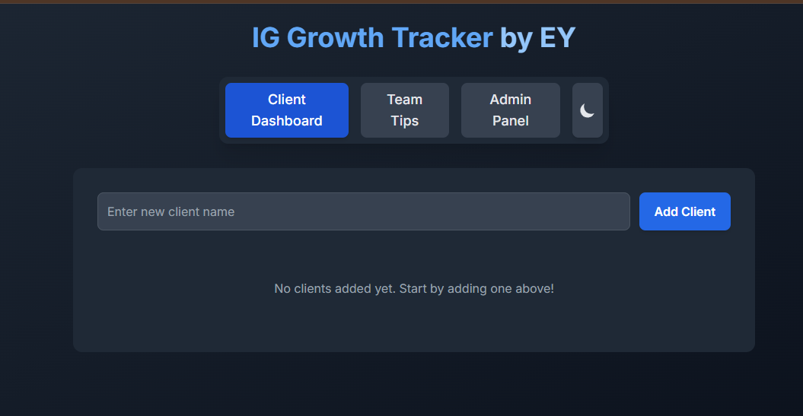

# Instagram Manual Growth Tracker by EY

## 📸 Screenshot



The Instagram Manual Growth Tracker is a clean, minimal, and effective tool designed to help social media managers, influencers, and marketers manually track follower changes, engagement metrics, and account growth over time — without relying on expensive software or complicated dashboards.

Built with simplicity in mind, this tracker allows you to visually monitor growth and activity trends, making data-driven decisions easy.

## 🚀 Features

- ✅ Add and update Instagram handles with follower and following counts
- 📊 Visual representation of growth over time
- 💾 Save and update your progress manually
- 🌓 Light & Dark mode friendly design
- 🖨️ Export data to CSV
- 📅 Date picker for daily/monthly tracking
- 🔐 100% local – no data stored or tracked online

## 📸 Use Case

Perfect for:

- Personal brand building
- Freelance social media managers
- Agencies managing client Instagram accounts
- Influencers tracking manual outreach or engagement

## 📁 Project Structure

Your project likely includes:

- index.html – the main file for the interface
- style.css – handles styling (light/dark mode, layout)
- script.js – handles interactivity and logic (add/update handles, track changes)
- data.csv – optional export format
- /assets – folder for icons, logos (optional)

## 💡 Getting Started

To use this tool locally:

1. Clone the repository:

   ```bash
   git clone https://github.com/elishahyousaf/instagram-growth-tracker.git
   cd instagram-growth-tracker
   ```

2. Open the index.html file in your browser:

   - Double click on index.html
   - Or right-click → Open with → Your preferred browser

No installation required. Works offline.

## 🛠️ Tech Stack

- HTML5
- CSS3 (Dark Mode support)
- JavaScript (vanilla)
- LocalStorage (for temporary in-browser data)
- FileSaver.js (optional, for CSV export)

## 📃 License

This project is licensed under the MIT License.  
You are free to use, copy, modify, and distribute this software for both personal and commercial purposes.

Read more: https://opensource.org/licenses/MIT

## ✍️ Author

Elishah Yousaf  
🔗 GitHub: [@elishahyousaf](https://github.com/elishahyousaf)  
📬 Feel free to reach out for collaboration, suggestions, or improvements.
